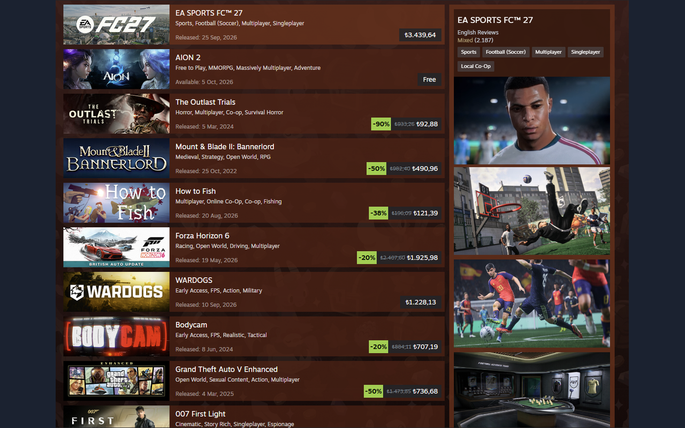

  

<h1 align="center">SteamTL</h1>

Steam’de USD fiyatlarının TL karşılığı.

<table>
  <tr>
    <td width="30%" align="center" valign="middle">
      
    </td>
    <td width="70%" align="center" valign="middle">
      
    </td>
  </tr>
</table>

Steam mağazasındaki fiyatları ve cüzdan bakiyesini yaklaşık TL karşılığıyla gösteren tarayıcı eklentisi.

TL fiyatı yaklaşık değerdir. Ödeme USD olarak kalır; banka kuru farklı olabilir.

Chrome ve Chromium tabanlı tarayıcılar için hazırlanmıştır.

---

### Özellikler

- **TL veya USD + TL** fiyat gösterimi.
- **Otomatik veya Manuel kur.** ECB’nin günlük kuru, tarayıcı açıkken 6 saatte bir kontrol edilir.
- **Mağaza, Oyun sayfaları ve Sepet** desteği.
- **Türkçe / İngilizce**, Açık / Koyu tema ve Kuruş gösterimi.
- **Güncellemelerde ayarlar korunur.**

### Kurulum

1. [Son sürümden](https://github.com/kyrokaan/SteamTL/releases/latest) `steam-tl-v1.8.14.zip` dosyasını indir ve çıkar.
2. Tarayıcının uzantılar sayfasında **Geliştirici modu**nu aç.
3. **Paketlenmemiş öğe yükle** ile `steam-tl` klasörünü seç.
4. Açık Steam sayfasını yenile.

### Gizlilik

SteamTL: Fiyatları ve Cüzdan bakiyesini yalnızca TL karşılığını göstermek için tarayıcı içinde işler; Saklamaz veya Dışarı göndermez. Kart ve Parola alanları okunmaz. Ayarlar ve Kur bilgisi yalnızca tarayıcıda saklanır. Otomatik Kur için ECB’ye bağlantı kurulur. Analitik ve Takip kullanılmaz.
