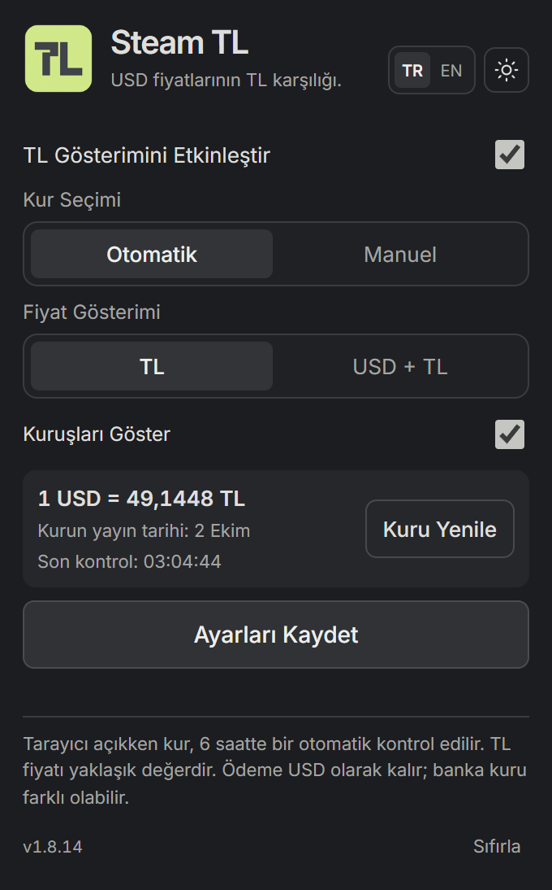

  

<h1 align="center">SteamTL</h1>

Steam’de USD fiyatlarının TL karşılığı.

  

Steam mağazasındaki fiyatları ve cüzdan bakiyesini yaklaşık TL karşılığıyla gösteren sade tarayıcı eklentisi.

- **TL veya USD + TL** fiyat gösterimi.
- **Otomatik veya Manuel kur.** ECB’nin günlük kuru, tarayıcı açıkken 6 saatte bir kontrol edilir.
- **Mağaza, Oyun sayfaları ve Sepet** desteği.
- **Türkçe / İngilizce**, Açık / Koyu tema ve Kuruş gösterimi.
- **Güncellemelerde ayarlar korunur.**

### Kurulum

1. [Son sürümden](https://github.com/kyrokaan/SteamTL/releases/latest) `steam-tl-v1.8.14.zip` dosyasını indir ve çıkar.
2. Tarayıcının uzantılar sayfasında **Geliştirici modu**nu aç.
3. **Paketlenmemiş öğe yükle** ile `steam-tl` klasörünü seç.
4. Açık Steam sayfasını yenile.

Chrome ve Chromium tabanlı tarayıcılar için hazırlanmıştır. Mağazaya yükleme paketi: `steam-tl-store-v1.8.14.zip`.

### Gizlilik

Fiyatlar ve Cüzdan bakiyesi saklanmaz veya dışarı gönderilmez. Kart ve Parola alanları okunmaz. Ayarlar ve Kur bilgisi yalnızca tarayıcıda saklanır.

TL fiyatı yaklaşık değerdir. Ödeme USD olarak kalır; banka kuru farklı olabilir. SteamTL, 

Valve veya Steam ile bağlantılı değildir.
